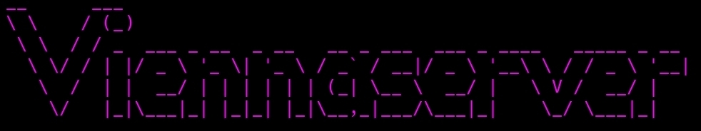

# Viennaserver



<p align="center">
  
  
  
  
  
  
</p>

## O que é?
Viennaserver é um servidor ***SSH e HTTP*** (expandindo para SFTP e outros no futuro)
O Viennaserver cbega comk un servidor fácil e pronto para iniciantes, com cada coisa pronta.
Instalação? O Viennaserver Installer faz.
Ligar servidores? O Viennaserver faz.
## Criado e mantido por:
[@bangkkuser](https://github.com/rebangkkuser)
## Instalando
No Linux (Debian)
```bash
curl -fsSL (O link não está disponível pois não desenvolvemos o script ainda.) | sudo bash
```
No Termux
```bash
curl -fsSL (O link não está disponível pois não desenvolvemos o script ainda.) | bash
```
# Observações 
O projeto ainda está em desenvolvimento.
Não lançamos uma versão estável.
